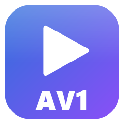
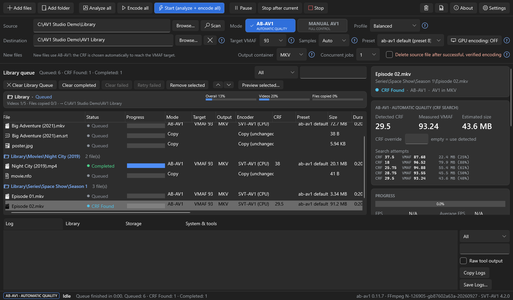
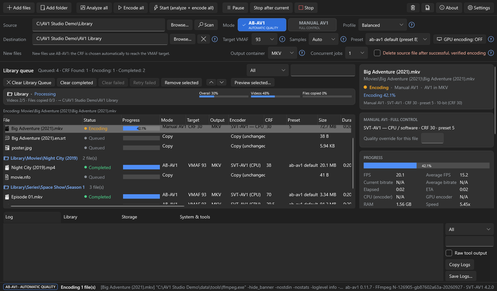
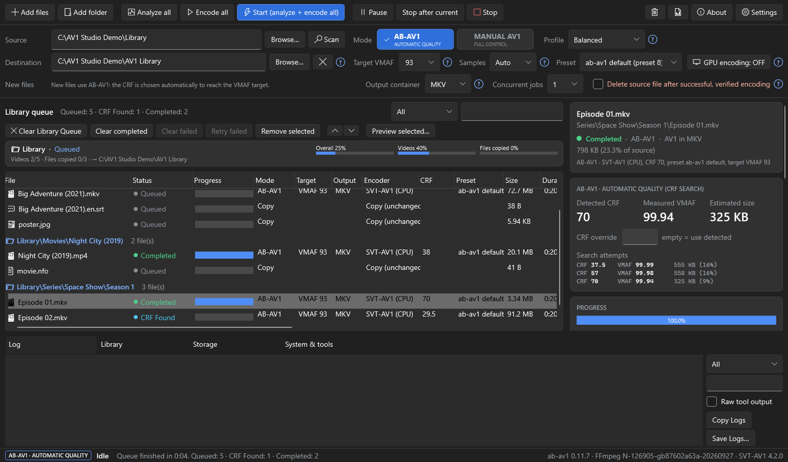
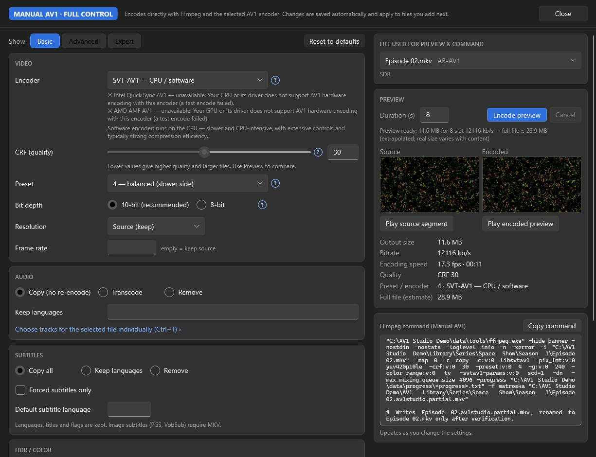
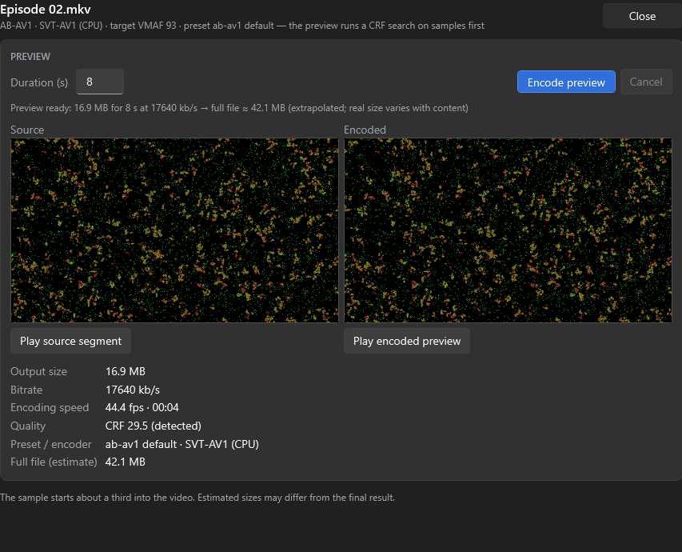
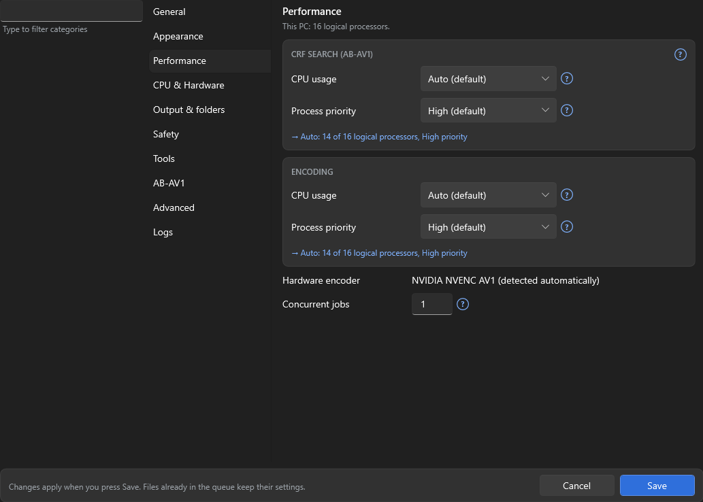
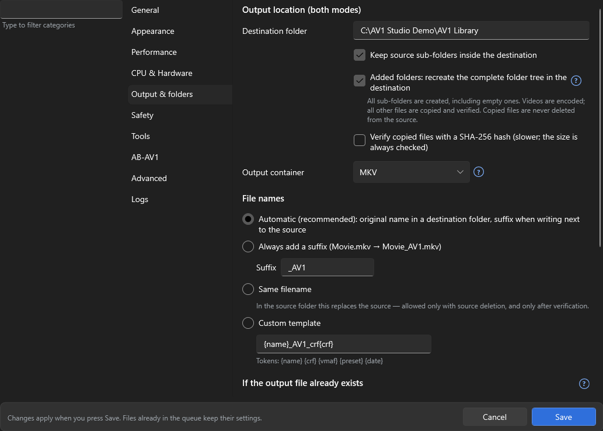

<p align="center">
  
</p>

<h1 align="center">AV1 Studio</h1>

<p align="center">
  <b>Shrink your video library with AV1 — automatically, safely, without losing quality.</b><br>
  A modern Windows app for encoding videos and whole folder trees to AV1.
</p>

<p align="center">
  <a href="https://github.com/midevski/AV1-Studio/releases"></a>
  
  
  <a href="LICENSE"></a>
</p>

<p align="center">
  
</p>

---

## What is AV1 Studio?

**AV1** is a modern video format that often makes files **30–50 % smaller** than H.264 at the same
visual quality. AV1 Studio converts your movies, series and home videos to AV1 — one file or an entire
library — and makes sure nothing is lost along the way.

It is a friendly front-end for the best open-source video tools: **[ab-av1](https://github.com/alexheretic/ab-av1)**,
**[FFmpeg](https://ffmpeg.org/)** and the **[SVT-AV1](https://gitlab.com/AOMediaCodec/SVT-AV1)** encoder. You choose
what you want; AV1 Studio runs the tools, shows exactly what they do, verifies every result, and keeps your
originals safe.

### Highlights

- 🎯 **Automatic quality** — pick a quality target (VMAF) and the right settings are found for *each* file.
- 🎛️ **Full manual control** — choose encoder, CRF, preset, filters, audio, subtitles and HDR yourself.
- 📁 **Whole folder trees** — the destination becomes a complete copy of your library: every folder, videos
  encoded, posters / subtitles / NFO files copied.
- 🛡️ **Safe by design** — every output is checked before it is accepted; originals are never deleted unless
  you ask, and only after a verified encode.
- ⚡ **CPU or GPU** — SVT-AV1 and libaom-av1 on the CPU, NVIDIA NVENC, Intel Quick Sync and AMD AMF on the GPU
  (each one is tested on your PC; only working encoders are offered).
- 📦 **MKV or MP4** output, HDR10 kept, all audio and subtitle tracks preserved.
- 🔁 **Resumable** — interrupted? Start again: finished files are reused, nothing is encoded twice.

## Screenshots

<table>
  <tr>
    <td width="50%"><br><sub><b>Encoding</b> — live progress, speed, ETA and folder progress.</sub></td>
    <td width="50%"><br><sub><b>Automatic quality</b> — the CRF search and the verified result.</sub></td>
  </tr>
  <tr>
    <td><br><sub><b>Manual AV1</b> — every setting, a live preview and the exact FFmpeg command.</sub></td>
    <td><br><sub><b>Preview</b> — encode a short sample and compare before committing.</sub></td>
  </tr>
  <tr>
    <td><br><sub><b>Performance</b> — CPU usage and priority, separately for analysis and encoding.</sub></td>
    <td><br><sub><b>Output & folders</b> — container, folder replica, file names, existing files.</sub></td>
  </tr>
</table>

## How it works

AV1 Studio has **two modes**. Both use the same queue, the same safety checks and the same output options.

| | **AB-AV1 · AUTOMATIC QUALITY** | **MANUAL AV1 · FULL CONTROL** |
|---|---|---|
| You choose | a quality target (VMAF, e.g. 93 or 95) | encoder, CRF/CQ, preset, filters, audio, subtitles, HDR… |
| AV1 Studio does | tests short samples of **each** file to find the smallest file that still reaches your target, then encodes | runs FFmpeg with exactly your settings |
| Best for | most people and mixed libraries | people who know which settings they want |

```
 Add files / folders ─► (CRF search) ─► encode to a temporary file ─► verify ─► rename ─► (delete source) ─► next
```

Every output is written under a temporary name and only accepted when **all** checks pass: the encoder
finished without errors, the file exists and is complete, it contains AV1 video in the chosen container,
its duration and audio/subtitle tracks match, and it decodes without errors. If anything is wrong, the file is
marked *Failed* and **the original is kept**.

**Folders:** add a folder, choose a destination, and AV1 Studio recreates the whole tree there — every
sub-folder (even empty ones), videos encoded with their original names, and every other file copied unchanged
and verified.

## Getting started

### 1. Download

Download **`AV1Studio.exe`** (portable) or the installer from the
**[Releases page](https://github.com/midevski/AV1-Studio/releases)**.
No installation of .NET is needed — the app is self-contained.

> Windows SmartScreen may warn about an unknown publisher the first time, because the app is new and not
> code-signed. Click **More info › Run anyway**.

### 2. Launch

Double-click **`AV1Studio.exe`**. On the first start, a short **system check** shows your CPU and GPUs, the
AV1 encoders that work on your PC, and the tools AV1 Studio needs:

| Tool | Needed for | Included? |
|---|---|---|
| **FFmpeg + FFprobe** (with libsvtav1, libvmaf) | encoding and analysing | downloaded with one click |
| **ab-av1** | AB-AV1 automatic-quality mode | downloaded with one click |

Click **Download missing tools** (they come straight from their official sources), or point AV1 Studio to
copies you already have (**Settings › Tools**).

### 3. Encode

1. Click **Add files** or **Add folder** — or drag & drop them onto the window.
2. Choose a **Destination** folder (optional — empty = next to the original, with an `_AV1` suffix).
3. Choose **AB-AV1** or **MANUAL AV1**, a **Profile** (Balanced, High Quality, Small File, Fast Encode,
   Archive) and the **Output container** (MKV or MP4).
4. Optional: select a file and click **Preview selected…** to check a short sample first.
5. Click **Start (analyze + encode all)**.

Every control has a tooltip, and the small **?** icons explain each option in plain words.

## CPU or GPU?

| | **Software (CPU)** — SVT-AV1, libaom-av1 | **Hardware (GPU)** — NVIDIA NVENC, Intel Quick Sync, AMD AMF |
|---|---|---|
| ➕ | best compression, most settings, works on every PC | much faster, low CPU usage |
| ➖ | slower, uses a lot of CPU | needs a recent GPU (e.g. RTX 40, Intel Arc, Radeon RX 7000), usually larger files |

AV1 Studio tests every encoder on your PC and explains why an unavailable one can't be used
(**Settings › CPU & Hardware**). CPU usage is **Auto** by default (nearly all threads, a few kept free for
Windows) at **High** priority, and can be changed separately for the analysis and the encode
(**Settings › Performance**).

## Requirements

- Windows 10 or 11, 64-bit
- FFmpeg, FFprobe and ab-av1 — downloaded by the app on first start if missing
- Optional: a GPU with AV1 hardware encoding for faster GPU encodes

## Build from source

You need the **[.NET 9 SDK](https://dotnet.microsoft.com/download/dotnet/9.0)**.

```powershell
git clone https://github.com/midevski/AV1-Studio.git
cd AV1-Studio

# run it
dotnet run --project src\AV1Studio

# or build the single-file executable (dist\AV1Studio.exe) — runs the tests first
.\build.ps1
```

See [docs/BUILD.md](docs/BUILD.md) for tests, the installer and portable mode.

## Documentation

- [Configuration](docs/CONFIGURATION.md) — every option and the exact tool arguments it uses
- [Troubleshooting](docs/TROUBLESHOOTING.md) — common problems and fixes
- [Building](docs/BUILD.md) — tests, publishing, installer

**Where are my settings?** In `%LOCALAPPDATA%\AV1 Studio` (settings, queue, logs, downloaded tools). For a
portable setup, put an empty file named `portable.txt` next to `AV1Studio.exe` — everything is then stored in a
`data` folder beside it.

## Keyboard shortcuts

| Shortcut | Action |
|---|---|
| Ctrl+O / Ctrl+Shift+O | Add files / add folder |
| F5 / Ctrl+F5 | Analyze all / Start (analyze + encode all) |
| Ctrl+E | Encode all |
| Ctrl+P · Ctrl+Shift+P · Shift+F5 | Pause/resume · stop after current · stop |
| Ctrl+R | Preview selected file |
| Ctrl+M | Manual AV1 settings |
| Ctrl+T | Choose audio/subtitle tracks |
| Ctrl+, · F1 · Ctrl+L | Settings · About · log folder |

## Reporting a problem

Please [open an issue](https://github.com/midevski/AV1-Studio/issues) and attach the **diagnostic report**
(*About › Diagnostics › Copy*) and, if possible, the log (*Log › Save Logs…*). Both leave out your user name,
computer name and personal folders — please review them before sharing.

Tested so far on Intel CPUs and NVIDIA RTX 40-series GPUs. AMD CPUs, Intel Quick Sync and AMD AMF are
supported and detected — reports from those systems are very welcome.

## License

AV1 Studio is open source under the [MIT License](LICENSE).

It is powered by [FFmpeg](https://ffmpeg.org/), [SVT-AV1](https://gitlab.com/AOMediaCodec/SVT-AV1),
[ab-av1](https://github.com/alexheretic/ab-av1) and [VMAF](https://github.com/Netflix/vmaf). These tools are
**not** bundled with AV1 Studio; they are downloaded from their official sources at your request and keep their
own licenses (FFmpeg: LGPL/GPL depending on the build; SVT-AV1: BSD-3-Clause-Clear; ab-av1: MIT;
VMAF: BSD-2-Clause-Patent).
